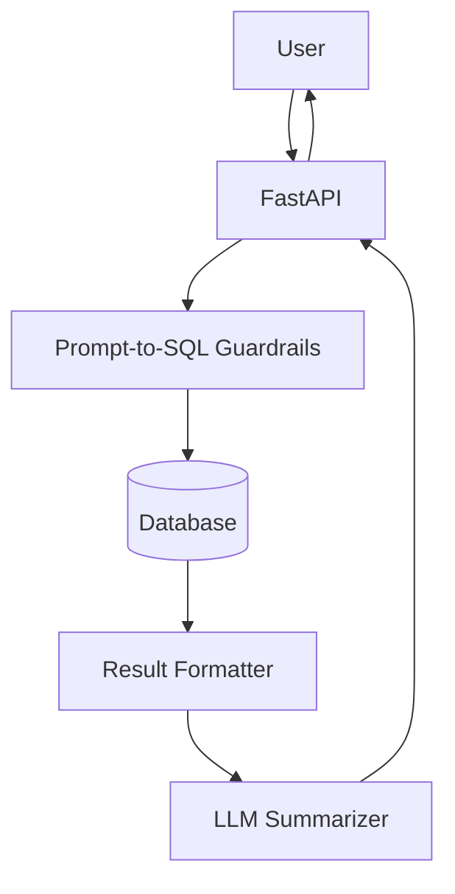

# llm-revenue-analyzer

LLM-powered **Revenue Reporting Assistant**: natural language → SQL insights + narrative summary (telco/Zuora-style).

## What you get (production-grade template)

- FastAPI service with structured logging
- Config via environment variables (`.env`)
- Dockerfile + local dev instructions
- Basic CI (GitHub Actions), linting (ruff), tests (pytest)
- Clean `src/` layout + typed interfaces

> **Important:** Do not commit secrets. Use `.env` locally and GitHub Secrets in CI/CD.

## What it does

- Accepts a natural language question
- Generates a safe SQL query template (parameterized)
- Executes against a configured database (demo: SQLite)
- Summarizes results using an LLM

> For client work (e.g., Zuora), you'd connect to the appropriate data warehouse and implement strict guardrails.

## Architecture



## Run locally

```bash
cp .env.example .env
python -m venv .venv && source .venv/bin/activate
pip install -e ".[dev]"
python scripts/seed_demo_db.py
make dev
```

## Example request

```bash
curl -X POST http://localhost:8000/v1/query \
  -H "Content-Type: application/json" \
  -d '{"question":"What were monthly recurring revenue totals by month in 2025?"}'
```

