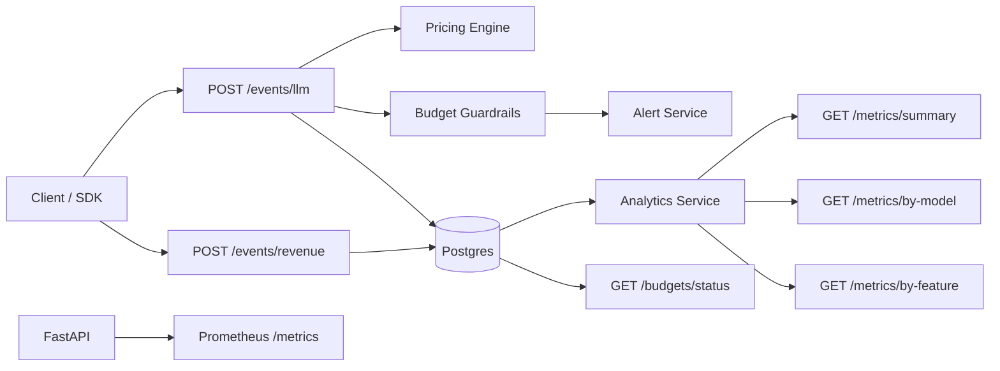
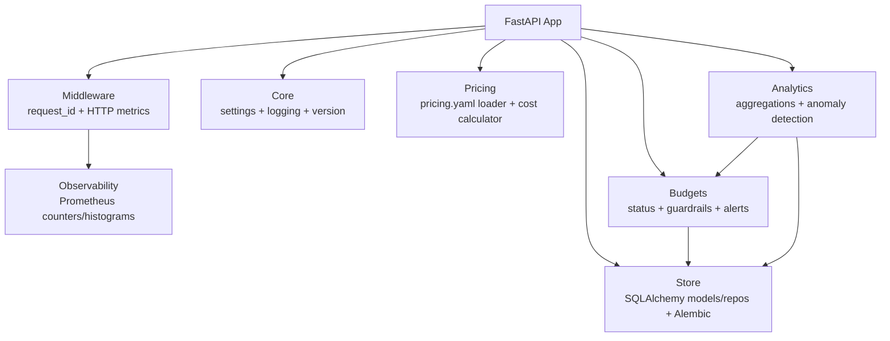
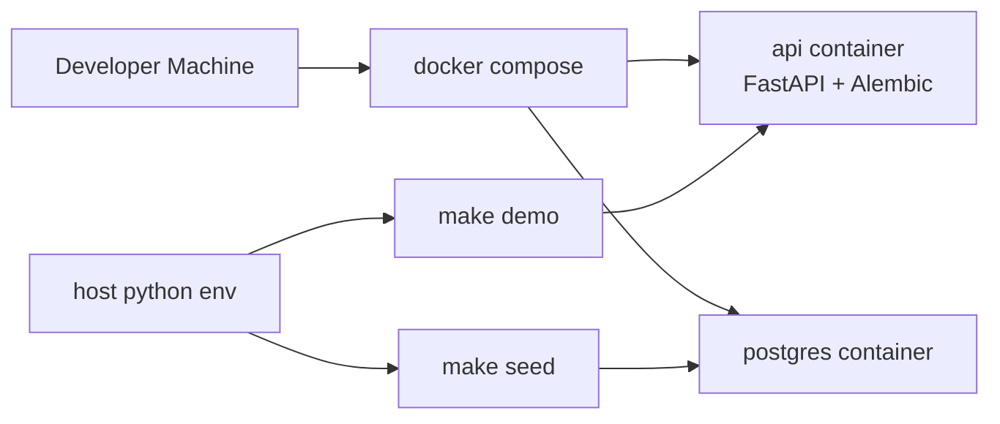

# Architecture

## Overview

The system ingests LLM usage + revenue events, computes missing LLM costs from a repo-local pricing catalog, applies budget guardrails, stores events in Postgres, and exposes analytics/health metrics via FastAPI.

## Data Flow

## Components

## Deployment (Local)

